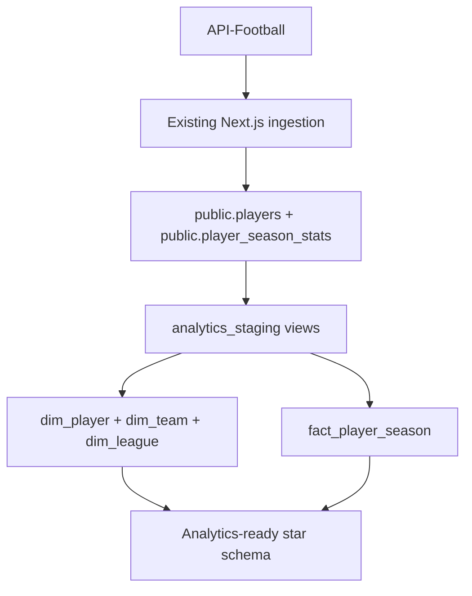
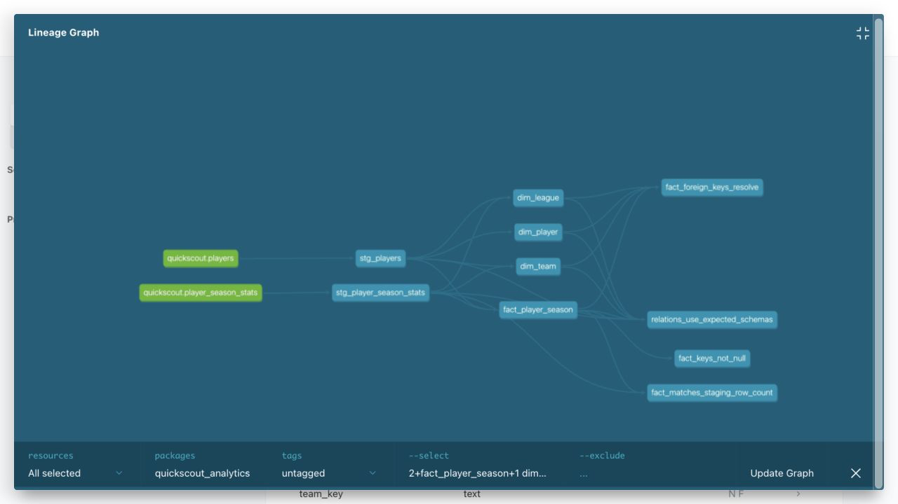

# QuickScout Football

QuickScout Football is an MVP scouting intelligence app that helps identify football players worth tracking using seeded player profiles, season stats, and recommendation runs.

## Project purpose

The goal is to provide a fast, explainable recommendation pipeline for scouting:

- Store player entities with stable provider IDs and normalized names.
- Track season-level performance metrics in a queryable table.
- Persist recommendation job history for repeatability and analysis.
- Keep the architecture lightweight while provider integrations mature.

## Analytics architecture (dbt Phase 0)

The application ingestion and recommendation paths remain unchanged. dbt reads the two existing PostgreSQL source tables after ingestion and builds an analytics-only star schema:



dbt creates these relations:

- `analytics_staging.stg_players`
- `analytics_staging.stg_player_season_stats`
- `analytics_marts.dim_player`
- `analytics_marts.dim_team`
- `analytics_marts.dim_league`
- `analytics_marts.fact_player_season`

`public.players` and `public.player_season_stats` remain application-owned sources. Do not rename or move them: the app and provider sync still access them directly.

### Analytics contract

`fact_player_season` has one row per `provider_source × player × normalized_season × competition_identity`. The canonical `player_season_id` is the same deterministic value as the backward-compatible `fact_player_season_key`; both columns are tested as non-null and unique.

Referential-integrity tests cover all three layers: source season stats resolve to source players, staging season stats resolve to staging players, and every fact row resolves to `dim_player`, `dim_team`, and `dim_league`.

The project defines exactly two custom business-rule test macros:

- `non_negative` rejects negative counting and performance metrics.
- `within_range` constrains `pass_accuracy` to the inclusive range from 0 to 100.

### Hosted validation (completed 2026-08-07)

Analytics Phase 0 was validated against hosted Supabase through the SSL-enabled session pooler. `dbt debug` passed, followed by two consecutive idempotent `dbt build` runs. Each build passed all 6 models and 74 data tests (`80/80`).

| Hosted metric | Result |
|---|---:|
| Staging views | 2 |
| Mart tables | 4 |
| Source players | 40 |
| Source season-stat rows | 40 |
| Staging player rows | 40 |
| Staging season-stat rows | 40 |
| Fact rows | 40 |
| Player dimension rows | 40 |
| Team dimension rows | 19 |
| League dimension rows | 7 |
| Providers | 2 |
| Seasons | 2 |
| Competition identities | 2 |

Row preservation was exact: `40 staging rows = 40 fact rows`. Duplicate checks for `fact_player_season_key` and `source_stats_id` returned zero rows, and all fact keys resolved to their dimensions without nulls or orphans. This hosted run predates the additive `player_season_id` alias and therefore reports 74 rather than the current 76 tests.



### Run dbt locally

dbt is a separate Python tool and is not installed through `npm`. Use Python 3.10 or newer:

```bash
python3.11 -m venv .venv-dbt
source .venv-dbt/bin/activate
python -m pip install -r analytics/requirements.txt
```

Copy the Postgres connection details from **Supabase Dashboard → Connect** and export them in the shell that will run dbt. Use a direct connection when available, or the session pooler on port `5432` when IPv4 is required.

```bash
export DBT_HOST=your-supabase-postgres-host
export DBT_PORT=5432
export DBT_USER=your-supabase-postgres-user
export DBT_PASSWORD=your-database-password
export DBT_DBNAME=postgres
export DBT_THREADS=4
export DBT_SSLMODE=require
```

The database user must be able to read `public.players` and `public.player_season_stats`, and create/update `analytics_staging` and `analytics_marts`.

Run validation and build commands from the repository root:

```bash
dbt parse --project-dir analytics --profiles-dir analytics
dbt debug --project-dir analytics --profiles-dir analytics
dbt build --project-dir analytics --profiles-dir analytics
dbt docs generate --project-dir analytics --profiles-dir analytics
```

Staging models are views and marts are tables. Tests enforce the normalized player-season-competition grain, exact output schema names, non-null dimension keys, referential integrity, and a one-to-one row count between staging stats and the fact.

### Analytics definition of done

GitHub Actions runs the analytics checks against a disposable PostgreSQL 16 service populated from `supabase/schema.sql` and `supabase/seed.sql`. It does not require hosted Supabase credentials. A successful run uploads `index.html`, `catalog.json`, `manifest.json`, and `run_results.json` as the `dbt-docs` artifact.

The first complete CI acceptance run passed on 2026-08-10: [`dbt analytics` run 31405455812](https://github.com/ChiCoTheLaAnh/QuickScoutFootball/actions/runs/31405455812) completed all 6 models and 76 data tests (`82/82`), verified that `player_season_id` exactly matches `fact_player_season_key`, generated the catalog, and uploaded the four-file `dbt-docs` artifact.

| Requirement | Evidence |
|---|---|
| `dbt debug` and `dbt build` pass | CI run 31405455812 passed 6 models and 76 data tests (`82/82`); hosted validation also passed twice. |
| 2 staging models | `stg_players` and `stg_player_season_stats`. |
| 3 dimensions | `dim_player`, `dim_team`, and `dim_league`. |
| 1 fact with a declared grain | `fact_player_season`, at provider-player-season-competition grain. |
| No duplicate `player_season_id` | `not_null` and `unique` tests run on the canonical key. |
| Relationships pass | Source, staging, and all three fact-to-dimension relationships are tested. |
| 2 custom business rules pass | `non_negative` and `within_range` are the only custom generic test definitions. |
| `dbt docs generate` runs | CI generated the catalog and uploaded the four-file `dbt-docs` artifact. |
| Architecture and lineage documented | The architecture diagram and hosted lineage screenshot are included above. |
| Resume uses measured metrics | The bullet below separates CI fixture metrics from hosted Supabase metrics. |

### Resume-ready project bullet

> Built a 6-model dbt/Postgres football analytics star schema (2 staging views, 3 dimensions, 1 fact), automated 76 fixture-backed data tests in GitHub Actions, and preserved 40/40 hosted player-season rows across two idempotent Supabase builds with 74 hosted tests per build.

### Team history limitation

`public.player_season_stats` has `team_provider_id` but no `team_name`. A historical team ID is retained in `dim_team`, but its name is null when that ID does not match the player's current team. When a stats row has no team ID, dbt falls back to the current team in `players`; after a transfer, that fallback may not represent the historical team. Phase 0 documents this limitation instead of changing the application source schema.

## Local setup

1. Install dependencies:

   ```bash
   npm install
   ```

2. Create environment file:

   ```bash
   cp .env.example .env.local
   ```

3. Start development server:

   ```bash
   npm run dev
   ```

4. (Optional) Apply Supabase schema from `supabase/schema.sql` to your local or hosted project.

## Running with seed fallback

Supabase is optional for local MVP development. Leave these values empty or unset in `.env.local`:

```bash
NEXT_PUBLIC_SUPABASE_URL=
NEXT_PUBLIC_SUPABASE_ANON_KEY=
SUPABASE_SERVICE_ROLE_KEY=
```

Then run:

```bash
npm install
npm run dev
```

The app will read from `src/data/seedPlayers.ts`.

## Running with Supabase

Set the required Supabase values in `.env.local`:

```bash
NEXT_PUBLIC_SUPABASE_URL=https://your-project-ref.supabase.co
NEXT_PUBLIC_SUPABASE_ANON_KEY=your-supabase-anon-key
SUPABASE_SERVICE_ROLE_KEY=your-supabase-service-role-key
```

`SUPABASE_SERVICE_ROLE_KEY` is optional for this MVP. Server reads use it when present and fall back to the anon key otherwise.

For a fresh Supabase project, first apply the baseline schema using the SQL editor by running the contents of:

```bash
supabase/schema.sql
```

The files under `supabase/migrations/` are additive and assume that baseline already exists. After applying `supabase/schema.sql`, use a linked Supabase CLI project to apply those migrations:

```bash
supabase db push
```

`supabase db push` is not a replacement for the baseline schema in this repository.

Apply seed data using the SQL editor by running the contents of:

```bash
supabase/seed.sql
```

Then start the app:

```bash
npm run dev
```

Provider ingestion is available through the manual API-Football sync command and the scheduled cron refresh route. Authentication and multi-provider enrichment remain staged for later phases.

## Quick start for scouts

1. Open the app home page.
2. Type a target player name, for example `Mohamed Salah`.
3. Select the player from the search suggestions.
4. Adjust role, age, market value, minutes, and recommendation mode.
5. Click **Get Recommendations**.
6. Review the ranked candidates, explanation text, and score breakdown.

The MVP is designed for replacement scouting: start with one target player, tune constraints, and compare the ranked alternatives.

## Verify locally

```bash
npm run lint
npm run test
npm run build
```

Optional real Supabase concurrency check (requires the three Supabase variables above and deliberately writes one uniquely keyed, completed `manual` row to `provider_sync_runs`):

```bash
RUN_SUPABASE_INTEGRATION_TESTS=1 \
npm test -- src/lib/supabase/providerSyncRuns.integration.test.ts
```

Optional production-mode smoke test (starts `next start` on port 3000):

```bash
npm run smoke:local
```

Optional cron health smoke test against a deployed app:

```bash
BASE_URL=https://your-app.vercel.app CRON_SECRET=... npm run smoke:cron
```

Optional endpoint performance review against a running app:

```bash
npm run perf:review
```

The review runs three unmeasured warmups, then 50 measured search requests and 50 measured recommendation requests as separate series. It reports median, nearest-rank p95, max, payload size, status counts, result counts, validation-error counts, and bounded error samples. All measured iterations are retained even when one fails. Requests are paced below the public route limits.

Use an exact provider identity in hosted environments where a name can appear more than once:

```bash
PERF_LABEL=supabase \
BASE_URL=https://your-app.vercel.app \
PERF_TARGET_PROVIDER_SOURCE=apiFootball \
PERF_TARGET_PROVIDER_PLAYER_ID=... \
PERF_REVIEW_SECRET=... \
npm run perf:review
```

## Deploy to Vercel

### Prerequisites

- Vercel account linked to this repository
- `npm run build` passes locally

### Environment variables

Set these in the Vercel project (**Settings → Environment Variables**):

| Variable | Required | Notes |
|----------|----------|-------|
| `NEXT_PUBLIC_APP_URL` | Recommended | Production URL, e.g. `https://your-app.vercel.app` |
| `NEXT_PUBLIC_SUPABASE_URL` | Optional | Omit for seed-only deploy |
| `NEXT_PUBLIC_SUPABASE_ANON_KEY` | Optional | Omit for seed-only deploy |
| `SUPABASE_SERVICE_ROLE_KEY` | Optional for app, required for provider sync | Server writes; app reads fall back to anon key |
| `CRON_SECRET` | Required for cron route | Vercel sends this as `Authorization: Bearer <CRON_SECRET>`; cron returns `503` if unset |
| `LOG_LEVEL` | Optional | `info` by default; supports `info`, `warn`, `error`, `silent` |
| `REFRESH_STALE_AFTER_HOURS` | Optional | Persisted cron-run stale threshold; defaults to `36` hours |
| `API_FOOTBALL_API_KEY` | Required for manual and cron provider sync | Sent as `x-apisports-key` |
| `API_FOOTBALL_PLAYERS_URL` | Optional single target | Direct API-Football `/players` URL with one allowed league and `season=2024` |
| `API_FOOTBALL_PLAYERS_URLS` | Required for a full Big Five run | Exact direct URLs for leagues `39,140,135,78,61`; do not duplicate `API_FOOTBALL_PLAYERS_URL` |
| `API_FOOTBALL_MAX_PAGES_PER_TARGET` | Optional | Fail-closed page cap; defaults to and cannot exceed `60` |
| `PERF_REVIEW_SECRET` | Temporary production acceptance only | Authenticates the mode that skips recommendation-run persistence; it does not bypass the request path or rate limit |

### Seed-only deploy (fastest MVP)

1. Import the repo in Vercel (framework preset: **Next.js**).
2. Leave Supabase variables **unset** — the app uses `src/data/seedPlayers.ts`.
3. Deploy. Recommendation runs are stored in-memory per serverless instance (not durable across cold starts).

### Supabase-backed deploy

1. Create a Supabase project and run `supabase/schema.sql` then `supabase/seed.sql` in the SQL editor.
2. Set all three Supabase env vars in Vercel.
3. Deploy. Runs persist in `recommendation_runs`.

### Cron note

The cron schedule stays disabled during the free staged backfills. For the final proof only, `vercel.json` temporarily schedules `GET /api/cron/refresh` at `05:00 UTC`. The route requires `Authorization: Bearer <CRON_SECRET>` and deterministically selects `[39, 140, 135, 78, 61]` using the UTC epoch day modulo five.

The cron route pins a 300-second maximum duration, enforces an internal 285-second provider deadline, and `vercel.json` enables Fluid Compute. The internal deadline aborts provider work early enough to persist failure state before Vercel's hard limit. Cron proof must use the Bundesliga `78` rotation slot; larger leagues cannot safely fit the free-tier 6200ms request pacing.

Each invocation first atomically claims both its unique persisted key and the provider-season quota scope `apiFootball:2024` in `provider_sync_runs`. The partial unique lock allows only one manual or cron run to consume that shared quota at a time. A duplicate event returns `200 skipped` before any provider request, including when the first invocation failed. A 10-minute lease is health metadata only; stale runs are never reclaimed automatically.

`GET /api/cron/health` uses the same authorization and reads persisted cron state. Season `2024` is historical, so this schedule is validation-only and must be removed after one scheduled canary plus duplicate/health evidence. The authenticated route remains available for deliberate manual validation.

### Deploy commands

```bash
npx vercel          # preview deploy
npx vercel --prod   # production deploy
```

### Post-deploy smoke test

Replace `BASE_URL` with your deployment URL:

```bash
BASE_URL=https://your-app.vercel.app \
SMOKE_TARGET_NAME='Mohamed Salah' \
SMOKE_TARGET_PROVIDER_SOURCE=apiFootball \
SMOKE_TARGET_PROVIDER_PLAYER_ID=306 \
npm run smoke
```

Checks:

- `GET /api/players/search?q=salah` returns results
- `POST /api/recommend` returns recommendations for Mohamed Salah
- `GET /` returns the home page

Run the same exact-identity browser flow against the deployment (setting `BASE_URL` prevents Playwright from starting a local server):

```bash
BASE_URL=https://your-app.vercel.app \
E2E_TARGET_NAME='Mohamed Salah' \
E2E_TARGET_PROVIDER_SOURCE=apiFootball \
E2E_TARGET_PROVIDER_PLAYER_ID=306 \
npm run test:e2e
```

To also verify the cron health endpoint after a production deploy:

```bash
BASE_URL=https://your-app.vercel.app CRON_SECRET=... npm run smoke:cron
```

Set `SMOKE_CRON_HEALTH_EXPECT_HEALTHY=1` when the deploy should already have a fresh successful cron run recorded.

You can also run the same smoke and optional E2E checks from GitHub Actions with **Production Smoke** (`workflow_dispatch`). Configure the repository secret `CRON_SECRET`, then provide the deployed `base_url` and exact provider identity. Enable `expect_healthy_cron` only after the scheduled cron should have run successfully.

### Hosted Supabase verification (optional)

After a Supabase-backed deploy:

1. Submit a recommendation on the home page (or via `POST /api/recommend`).
2. Call `GET /api/recommendation-runs` — confirm a recent run appears.
3. Call `GET /api/recommendation-runs/[runKey]` — confirm stored response payload.

Or run against production with credentials configured:

```bash
BASE_URL=https://your-app.vercel.app npm run smoke:supabase
```

(`smoke:supabase` requires Supabase env vars on the target deployment.)

## Manual API-Football sync

API-Football sync is an explicit operator action. A bare `npm run sync:api-football` fails closed; choose a canary or full target. The same ingestion service is used by the scheduled cron route.

Set Supabase write credentials and API-Football credentials:

```bash
NEXT_PUBLIC_SUPABASE_URL=https://your-project-ref.supabase.co
NEXT_PUBLIC_SUPABASE_ANON_KEY=your-supabase-anon-key
SUPABASE_SERVICE_ROLE_KEY=your-supabase-service-role-key
API_FOOTBALL_API_KEY=your-api-football-key
API_FOOTBALL_PLAYERS_URLS=https://v3.football.api-sports.io/players?league=39\&season=2024,...
API_FOOTBALL_MAX_PAGES_PER_TARGET=60
```

Probe page one of all five leagues without writing players or facts:

```bash
npm run probe:api-football
```

Run one league per invocation. Page 1 is both the quota probe and the first ingested page; it is not fetched twice. The free staged schedule is repeated for Pass 2:

```bash
npm run sync:api-football -- --league=39
npm run sync:api-football -- --league=140
npm run sync:api-football -- --league=135
npm run sync:api-football -- --league=78
npm run sync:api-football -- --league=61
```

The successful page-1 probe must include all four parseable daily/minute limit and remaining headers; a retryable response before that probe succeeds must also include them. For a target with `P` pages, the gate requires `ceil(P × 1.20)` requests and reconstructs pre-probe headroom with `dailyRemainingAfterProbe + probeRequests`, including probe retries. After the probe, missing headers use a conservative ledger: every HTTP attempt decrements daily/minute remaining, later daily headers may only lower the ledger, and a real minute header may reset the minute window. Synthetic minute exhaustion never adds a 60-second wait. Summaries report missing-header responses, ledger estimates, and the final conservative quota. More than 60 pages aborts instead of truncating. Request starts, including retries, are at least 6200ms apart. A target stops before a page or retry when the ledger cannot finish its remaining pages. 429/5xx responses get at most three retries, while confirmed daily exhaustion is not retried.

Treat each day as a provider quota window confirmed from live headers, not an assumed timezone reset. Pass 1 and Pass 2 each use league `39`, then `140`, then `135` on separate quota days. On the fourth day run `78` and then `61` as separate commands; the second command performs its own gate against quota left after `78`. If it fails closed, defer `61` to the next quota window without reducing the 20% buffer. Do not use `--full` for this rollout and do not run these backfills through Vercel.

As observed on 2026-08-10, the live API-Football Free plan rejects `page > 3`. Because league 39 reports 57 pages, the league-level staged rollout is blocked before any upsert and must not be retried unchanged. Any team-scoped partitioning or other request-shape redesign requires a separate quota/identity review and explicit approval.

Each manual invocation is persisted with a random key, so two same-day backfills remain distinct while still running sequentially under the global provider-season lock. Player upserts are batched at 250 and fact upserts at 500. The JSON summary reports target pages/facts/skips, quota before/after, missing-header/ledger-estimate counts, retries, duration, and truncation status without printing secrets, configured URLs, raw payloads, or full records.

Audit the canary or full corpus. Supply the first full audit checksum to the second audit to prove content stability while ignoring timestamps:

```bash
AUDIT_MODE=canary npm run audit:api-football
AUDIT_MODE=full npm run audit:api-football
AUDIT_MODE=full AUDIT_EXPECTED_CONTENT_CHECKSUM=<first-checksum> npm run audit:api-football
```

For independent hosted evidence, run the read-only query in `supabase/audits/big_five_2024.sql` through the Supabase SQL editor (or the connected Supabase tool) after each full backfill. It reports the exact league set, per-league facts, identity/fact duplicates, orphans, target coverage, usable volume, same-name collisions, and missing market value/xG/xA counts. The script above remains the source of the timestamp-free SHA-256 content checksum.

## API routes

MVP route surface:

- `GET /api/players` — list all players, or search with `?q=`.
- `GET /api/players/search?q=` — alias for player search (same response shape as `GET /api/players?q=`).
- `GET /api/players/[id]` — fetch one player with latest stats.
- `POST /api/recommend` — run the recommender and persist a `recommendation_runs` record.
- `GET /api/recommendations` — fetch the latest completed recommendation output.
- `GET /api/recommendation-runs` — list recent run metadata (newest first, limit 20).
- `GET /api/recommendation-runs/[runKey]` — fetch one run including stored response payload.
- `GET /api/cron/refresh` — authenticated API-Football validation route; temporarily scheduled during the canary rollout.
- `GET /api/cron/health` — authenticated snapshot of persisted cron run state.

Recommendation runs are stored in Supabase when configured; otherwise they are kept in an in-memory buffer for the current server process (seed-only local dev).

## Production hardening notes

- Server routes emit JSON-style logs to stdout with event name, route, status, duration, and safe metadata. Logs do not include full request payloads, recommendation responses, or secrets.
- Search and recommendation success logs include performance metadata such as result counts, candidate counts, and response payload size.
- Public MVP routes use best-effort in-memory rate limits per IP and route: `POST /api/recommend` allows 20 requests per minute, and nonblank `GET /api/players/search` allows 60 requests per minute.
- Rate-limit responses use the additive API error shape with `code: "RATE_LIMITED"` and status `429`.
- Cron calls must include `Authorization: Bearer <CRON_SECRET>`; missing or invalid secrets return `CRON_UNAUTHORIZED`, unset `CRON_SECRET` returns `CRON_NOT_CONFIGURED`, persisted-claim failures return `CRON_REFRESH_CLAIM_FAILED`, and sync failures return `CRON_REFRESH_FAILED`.
- Cron refresh success and failure logs include persisted-run health metadata (`refreshStatus`, `isStale`, `leaseExpired`, `needsAttention`, timestamps, and stale threshold). Failed syncs also emit `cron.refresh.alert`.
- `provider_sync_runs` and its claim/finalize RPCs are service-role-only. There is no in-memory lock fallback because duplicate invocations must fail closed before provider access.

## Cron operations runbook

Use this after each production deploy with Supabase, API-Football, and `CRON_SECRET` configured.

1. Confirm the deploy is reachable:

   ```bash
   BASE_URL=https://your-app.vercel.app npm run smoke
   ```

2. Confirm cron health authorization and response shape:

   ```bash
   BASE_URL=https://your-app.vercel.app CRON_SECRET=... npm run smoke:cron
   ```

3. After the single scheduled `05:00 UTC` canary, confirm Vercel cron history shows `GET /api/cron/refresh` ran. Call the route again on the same UTC date and confirm `status: "skipped"` with zero provider requests. Then require healthy persisted state:

   ```bash
   SMOKE_CRON_HEALTH_EXPECT_HEALTHY=1 BASE_URL=https://your-app.vercel.app CRON_SECRET=... npm run smoke:cron
   ```

4. Check structured logs:
   - Success: `cron.refresh.completed` with `refreshStatus: "healthy"` and provider counts.
   - Failure: `cron.refresh.failed` plus `cron.refresh.alert`.
   - Health check: `cron.health.completed` or `cron.health.attention_required`.

5. Triage failures:
   - `CRON_NOT_CONFIGURED`: set `CRON_SECRET` on the deployment.
   - `CRON_UNAUTHORIZED`: align Vercel cron authorization and the deployment `CRON_SECRET`.
   - `CRON_REFRESH_FAILED`: verify `API_FOOTBALL_API_KEY`, `API_FOOTBALL_PLAYERS_URL` or `API_FOOTBALL_PLAYERS_URLS`, Supabase service-role credentials, and provider quota.
   - `status: "unknown"`: no completed persisted cron run is visible yet.
   - `status: "stale"`: the latest running lease expired or the completed persisted run is older than `REFRESH_STALE_AFTER_HOURS`.

6. After evidence is recorded, remove `crons` from `vercel.json`, remove `PERF_REVIEW_SECRET`, redeploy, and smoke once more. Do not keep refreshing historical season 2024.

The GitHub Actions **Production Smoke** workflow runs the smoke script and, by default, the exact-identity Playwright flow against a supplied `base_url`. It is intentionally not part of pull-request CI because it depends on deployed infrastructure and the `CRON_SECRET` repository secret.

## Seed-data-first architecture

This project follows a **seed-data-first** approach:

- Start with curated static/seeded datasets to validate product flow.
- Model entities exactly as they will appear in production provider syncs (IDs, timestamps, metadata).
- Keep ingestion deterministic so recommendation outputs are reproducible during early testing.
- Gradually swap seed pipelines with provider sync jobs without changing downstream API contracts.

## Provider integration plan

Provider integrations are intentionally staged:

1. **Phase 1 — Seed baseline**
   - Seed canonical players and season stats.
   - Build ranking/recommendation logic against stable schema.

2. **Phase 2 — Single provider sync**
   - First provider: API-Football.
   - Fetch raw players through validated direct URLs using `API_FOOTBALL_API_KEY`.
   - Transform raw payloads in `src/lib/provider/apiFootball.ts`.
   - Upsert normalized players and season stats with `src/lib/supabase/providerSync.ts`.
   - Run an explicit canary or full sync; a target-less command fails closed.
   - Keep `/api/recommend` and UI response shapes unchanged.

3. **Phase 3 — Multi-provider enrichment**
   - Add advanced event and scouting metrics.
   - Reconcile conflicts via confidence rules and source precedence.

4. **Phase 4 — Fully automated refresh**
   - Use cron only to validate delivery and durable duplicate protection for historical season 2024.
   - Monitor persisted run state, structured logs, and Vercel cron visibility.

5. **Phase 5 — Expanded API-Football coverage**
   - Continue using API-Football as the only active provider.
   - Fetch one or more full player endpoint URLs through `API_FOOTBALL_PLAYERS_URL` and `API_FOOTBALL_PLAYERS_URLS`.
   - Filter every statistics block to the exact target league and season before aggregation.
   - Follow actual provider pagination up to the fail-closed cap of 60.
   - Preserve canonical identity as provider source plus provider player ID.
   - Keep downstream app and recommendation API contracts unchanged.

This keeps MVP delivery fast while preserving a path to production-grade data operations.

### API-Football field mapping

The first sync path expects provider payloads that can supply:

- external player ID (`player.id`)
- normalized name (`player.name` or `firstname` + `lastname`)
- age or birth date (`player.age` currently mapped)
- nationality (`player.nationality`)
- position, team, and league from the target fact with the most aggregated minutes (league-ID tie-break)
- market value when a provider payload supplies it
- one fact per provider player, target league, and season; multi-team blocks are summed
- pass accuracy weighted by pass totals per block, falling back to minutes only when that block has no positive pass total
- season stats used by scoring: appearances, starts, minutes, goals, assists, shots, key passes, pass accuracy, tackles, interceptions, dribbles, aerial duels, cards, saves, and goals conceded

Set these variables before running the manual sync service:

```bash
API_FOOTBALL_API_KEY=...
API_FOOTBALL_PLAYERS_URLS=...
```
